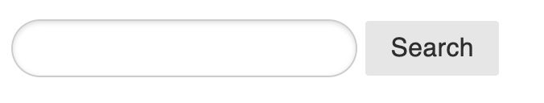
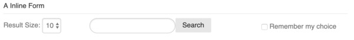

## Assignment 7 - Dynamic Page Building 
#### Due: Monday July 29<sup>th</sup> by 10:10am

### Part 1

**NOTE: All your requests should contain a `start` and a `chunk` parameter. You should never allow a search to result in thousands of items to be returned (in this instance anyway).**

I'm assuming you have some html page to use already. I suggested templates from here: https://purecss.io/layouts/

Add a search box to your main page that accepts a key word and searches the title of all candy products for a partial match. For example: `lemon` would find all titles with the keyword `lemon` in it: `lemonade` `lemon sours` `flavored hard candies (lemon)` etc. You don not have allow multiple words, although there are ways to make that happen as well. Your results should populate the contents portion of the page using your knowledge of grid from previous lessons. This part of the lesson only requires what we already know, and uses all the routes I gave you. No changes to the API.

```html
<!-- https://purecss.io/forms/ -->
<form class="pure-form">
    <input type="text" class="pure-input-rounded">
    <button type="submit" class="pure-button">Search</button>
</form>
```



Make sure you always limit your searches to no more than about 25 results. You can even allow a user to choose how many they would like displayed if you want. We can talk about "remember my choice next week".

```html
<form class="pure-form">
    <fieldset>
        <legend>A Inline Form</legend>
        <div class="pure-g">
            <div class="pure-u-1 pure-u-md-1-4">

                <label for="resultCount">Result Size:</label>
                <select id="resultCount">
                    <option>10</option>
                    <option>25</option>
                    <option>50</option>
                </select>
            </div>
            <div class="pure-u-1 pure-u-md-1-4">
                <input type="text" class="pure-input-rounded">
                
            </div>
            <div class="pure-u-1 pure-u-md-1-4">
                    <button type="submit" class="pure-button">Search</button>
            </div>
            <div class="pure-u-1 pure-u-md-1-4">
                <label for="remember" class="pure-checkbox">
                    <input id="remember" type="checkbox"> Remember my choice
                </label>
            </div>

    </fieldset>
</form>
```



### Implenting Part 1

### Files and DB

- Create a folder in your web root (/var/www/html/) called `candy_store`.
- Images are here: https://profgriffin.com/candy_store/images.zip
- From your terminal, after you log into your server, run: `wget https://profgriffin.com/candy_store/images.zip`
- The database sql to create and load your table is here: https://profgriffin.com/candy_store/candy.sql
- From the command line you can run `mysql -u username -p database_name < candy.sql` to import a sql file. 
  - Replace `username` with your mysql username and `database_name` with your database name. The `-p` means "prompt for my password"


### Api

- Grap the API from here: https://profgriffin.com/candy_store/api.zip
- Unzip it in your `candy_store` folder.
- Change the credentials for your mysql user.

### Up To Now

You should have a file structure like:

```
-> var
    -> www
        -> html
            -> candy_store
                -> api
                    -> classApi.php
                    -> classCandyApi.php
                    -> ...
                -> images
                    -> lots of images
                    -> ...
                -> index.html
```


### Usage and Getting Data

**Summary**

1. Your database should have a populated `candy` table.
2. You should be able to log into phpmyadmin and run some simple queries to select data:
    - `SELECT * FROM candy WHERE price < 14.99 LIMIT 0 , 10`
3. Your api folder should be in your `candy_store` folder.
4. Your config file should contain your authentication credentials.
5. You shuould be able to goto the URL: https://profgriffin.com/candy_store/api/ and get output to your browser.
6. You should be able to goto the URL's below, and get results from YOUR database (replace my domain name with your IP).
7. Lastly, you should be able to create a very simple html page:

- All these routes work on my server. 
- After you install everything they should work on your server as well.
- Replace `profgriffin.com` with `your.ip.address`

  - https://profgriffin.com/candy_store/api/?route=candy&keyword=mints&column=category&start=50&chunk=10
  - https://profgriffin.com/candy_store/api/?route=candy&keyword=lemon&column=title&matchtype=wildcard
  - https://profgriffin.com/candy_store/api/?route=candy&max=3.99&column=price
  - https://profgriffin.com/candy_store/api/?route=candy&min=14.99&column=price&start=10&chunk=10&max=44.99

**example request**
```js
$.get("https://profgriffin.com/candy_store/api?route=candy&max=3.99&column=price&start=0&limit=10", form_data)
    .done(function (data) {
        console.log(data);
    });
```

Here is a working example with a minimilistic html page: [bare_bones](./bare_bones)

## Part 2

- Use the getCategories route to obtain data that will populate a dropdown list with all the categories. 
- Place this dropdown somewhere on your page along with a submit button. 
- When a user chooses a category, populate your contents area with 10 items from that category.
  - Only display the `image`, the `title` and the `price` for right now.
- At the bottom of your results, place a `next` button, that when clicked will display the next 10 items.
- NOTE: if you look at the results the API sends back it looks like:
  
```json
{
    "count": 10,
    "start": "10",
    "chunk": "10",
    "success": true,
    "data": [
    {
        "id": "10672",
        "title": "Canel's Gum 4 pack",
        "price": "2.99",
        "amount": "60",
        "units": "ct",

...
```
- Notice it shows `start` and `chunk`. We will use this to allow us to go back and forth when paginating later.
- For now lets only go forward, and here is a hint on how to make it happen:
- https://api.jquery.com/data/ (talks about data attributes or any attribute that looks like `data-key = value`)

```html

<!-- at the bottom of your output -->

<button id="next" data-start="10" data-chunk="10"> >Next</button>

<script>
$("#next").on("click",function(event) {
    var start = $(this).data("start");
    var chunk = $(this).data("chunk");
    var url = "https://profgriffin.com/candy_store/api?route=candy&max=3.99&column=price";
    getData(url,start,chunk)
});


function getData(url,start,chunk)
    let geturl = url+'&start='+start+'&chunk='+chunk
    $.get(geturl)
        .done(function (data) {
            console.log(data);
        });
}
</script>
```


### Deliverables

- We will discuss putting your code on github Monday. I need to show you how to hide your passwords.
- Create a folder called `candy_store`. This will be located at `/var/www/html`.
- I should be able to see your grid creation by going to: `http://your.ip.address/candy_store`
- Create a folder called `images` and place it inside your `candy_store` folder along with ALL the images.
- Put the `api` folder in your `candy_store` folder. 
- Create an `index.html` file that will implement all discussed above.
- I don't grade creativity, but I will grade effort and attempted good layout. 
    - Things aligned
    - Things grouped well
- Remember to comment your code!  
- And remember `.gitignore` your config.php files!
